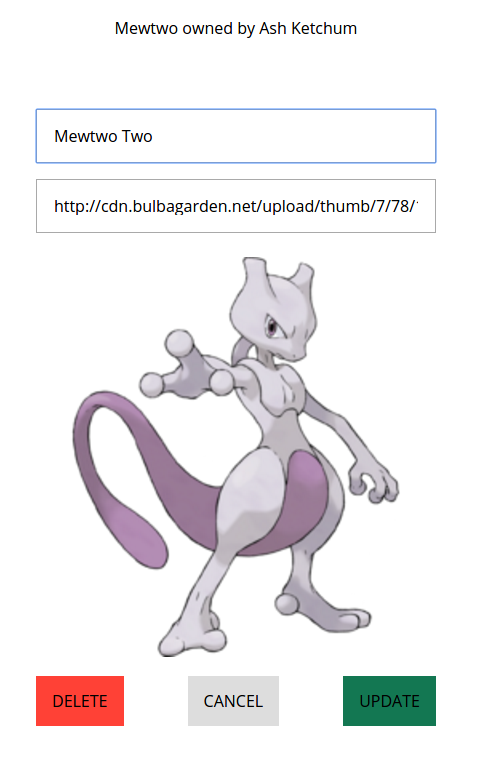

# Tutorial 06 - Multiple Mutations

Welcome to the 6th exercise in the **React Track** of this Apollo Client Tutorial!

## Goal

The **goal** of this exercise is to add the possibility to update and delete existing pokemons:
 

 
This will both let you increase your understanding of mutations as well as show you how you can add multiple mutations to the same component.

## Introduction

Change to the 6th exercise, install the dependencies and run the Pokedex React App from your console

```sh
cd pokedex-react/exercise-06
yarn install # or npm install
yarn start # or npm start
```

## Updating and deleting pokemons

Let's use what we learned about mutations in the last exercise to start using the `updatePokemon` and `deletePokemon` mutations.
You will add an update and a delete button to the `PokemonCard` component that call the according mutation when clicked. Let's get started then!

### Changes to `PokemonCard`

We already prepared some changes to the `PokemonCard` component and updated `PokemonPage` accordingly. Let's have a closer look at `PokemonCard`. First of all, we introduced `name` and `url` as part of the component's state:

```js
state = {
  name: this.props.pokemon.name,
  url: this.props.pokemon.url,
}
```

The state gets initialized with the passed props and `onChange` events for the two input elements update the according part of the state:

```js
<input
  className='w-100 pa3 mv2'
  value={this.state.name}
  placeholder='Name'
  onChange={(e) => this.setState({name: e.target.value})}
/>
<input
  className='w-100 pa3 mv2'
  value={this.state.url}
  placeholder='Image Url'
  onChange={(e) => this.setState({url: e.target.value})}
/>
{this.state.url &&
  
}
```

The update and delete buttons were added:

```js
<div className='flex justify-between'>
  <button className='pa3 bn dim ttu bg-red pointer' onClick={this.handleDelete}>Delete</button>
  <button className='pa3 bn dim ttu pointer' onClick={this.props.handleCancel}>Cancel</button>
  {this.canUpdate()
    ? <button className='pa3 bn dim ttu bg-dark-green pointer' onClick={this.handleUpdate}>Update</button>
    : <button className='pa3 bn ttu gray light-gray'>Update</button>
  }
</div>
```

However, you have to implement the `onClick` methods yourself. Before that, let us define the required mutations together. As both mutations need the `id` of the pokemon, we have to update the `pokemon` fragment in the `PokemonCard` by adding the `id`:

```js
static fragments = {
pokemon: gql`
  fragment PokemonCardPokemon on Pokemon {
    id
    url
    name
  }
`
}
```

### The `updatePokemon` mutation

We want to be able to update pokemon names and image URLs. That's why we make use of `updatePokemon` and its arguments `name` and `url`. Add this mutation to the `PokemonCard`:

```js
const updatePokemon = gql`
  mutation updatePokemon($id: ID!, $name: String!, $url: String!) {
    updatePokemon(id: $id, name: $name, url: $url) {
      id
      name
      url
    }
  }
`
```

You can also use fragments in mutations the same way you do in queries. We could write the `updatePokemon` mutation like this as well:

```js
const updatePokemon = gql`
  mutation updatePokemon($id: ID!, $name: String!, $url: String!) {
    updatePokemon(id: $id, name: $name, url: $url) {
      id
      ... PokemonCardPokemon
    }
  }
  ${PokemonCard.fragments.pokemon}
`
```

We included the `id` in the query selection for good measure, even though it is already included in the `PokemonCardPokemon` fragment.

Let's now think about the `deletePokemon` mutation before we will use both mutations and inject them to `PokemonCard`.

### The `deletePokemon` mutation

The `deletePokemon` mutation only needs the `id` pokemon to delete it. Add it to `PokemonCard` as well:

```js
const deletePokemon = gql`
  mutation deletePokemon($id: ID!) {
    deletePokemon(id: $id) {
      id
    }
  }
`
```

### Combining multiple mutations when wrapping components

Now it's time for you to inject these mutations to `PokemonCard`. By default, injected mutations are accessible with `this.props.mutate`. But how can we inject multiple mutations? We simply provide a `name` option:

```js
const PokemonCardWithMutations =  graphql(deletePokemon, {name : 'deletePokemon'})(
  graphql(updatePokemon, {name: 'updatePokemon'})(PokemonCard)
)

export default PokemonCardWithMutations
```

This results in the two new props `updatePokemon` and `deletePokemon`, so let's reflect that when defining the `propTypes`:

```js
static propTypes = {
  pokemon: PokemonCard.fragments.pokemon.propType,
  handleCancel: React.PropTypes.func.isRequired,
  afterChange: React.PropTypes.func.isRequired,
  updatePokemon: React.PropTypes.func.isRequired,
  deletePokemon: React.PropTypes.func.isRequired,
}
```

### Connect the buttons with the mutations

Finally, you can now call the mutations from within the `onClick` of the buttons:

```js
handleUpdate = () => {
  this.props.updatePokemon({variables: { id: this.props.pokemon.id, name: this.state.name, url: this.state.url }})
    .then(this.props.afterChange)
}

handleDelete = () => {
  this.props.deletePokemon({variables: { id: this.props.pokemon.id }})
    .then(this.props.afterChange)
}
```

Again, we are making use of the promise returned by the mutations to call another function after the mutation results came in.

Check if you got everthing right by opening [http://localhost:3000](http://localhost:3000) in your browser and click on an existing pokemon button. Update one of its attributes and click the update button. You should get back to the updated pokemon list. Repeat the same but this time delete the pokemon.

## Recap

* We saw how we can **update and delete** pokemons using mutations
* **Injecting multiple mutations** is possible by using the `name` option
